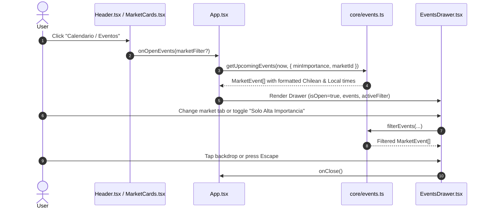

# Design: Market Events Calendar Technical Architecture

## Technical Approach

Introduce a decoupled, offline-first economic calendar module into the existing React 19 / TypeScript / Tailwind CSS architecture. The solution pairs a pure domain service layer (`src/core/events.ts`) that manages scheduled macroeconomic catalysts and handles IANA timezone conversions with an accessible, mobile-optimized overlay presentation (`src/components/EventsDrawer.tsx`).

## Architecture Decisions

| Decision | Choice | Alternatives Considered | Rationale |
|:---|:---|:---|:---|
| **Data Provider Strategy** | Curated Static Catalog in `src/core/events.ts` | Live external API, GitHub Action cron | Complete offline support (essential for PWA), zero client API key exposure, no third-party rate limits or CORS issues, and deterministic unit testing. |
| **Drawer UX Pattern** | Slide-Over Sheet via Tailwind & Framer Motion | New page route, Modal dialog | Preserves single-page state, fits natural mobile gestures (swipe/tap backdrop to close), and leaves the 24h timeline uncluttered. |
| **Time Projection** | Luxon `DateTime.fromISO(...).setZone(...)` | Manual UTC offset math | Reuses existing Luxon infrastructure; accurately formats both Chilean reference time (`America/Santiago`) and each exchange's native time with full DST fidelity. |
| **Filtering Strategy** | In-Memory Client Filtering | Dynamic backend search | Dataset size (~50-100 key macro events per quarter) is tiny (<15KB); instantaneous (<1ms) filtering without re-rendering the timeline grid. |

## Data Flow & Sequence Diagram



## Component & Module Hierarchy

```
src/
├── core/
│   ├── types.ts              <-- Extended with MarketEvent, EventImportance, EventCategory
│   ├── events.ts             <-- Dataset & pure query/formatting functions
│   └── events.test.ts        <-- Unit tests (filtering, sorting, timezone mapping)
├── components/
│   ├── EventsDrawer.tsx      <-- Slide-over drawer with market tabs & event cards
│   ├── Header.tsx            <-- Adds "Eventos" trigger button with attention badge
│   └── MarketCards.tsx       <-- Adds event count badge & click trigger per market
└── App.tsx                   <-- Coordinates drawer state and passes reference time
```

## Interfaces & Contracts

```typescript
export type EventImportance = 'medium' | 'high';

export type EventCategory =
  | 'central_bank'
  | 'inflation'
  | 'gdp'
  | 'employment'
  | 'holidays';

export interface MarketEvent {
  id: string;
  marketId: string; // 'nyse' | 'twse' | 'krx' | 'sse' | 'nse' | 'chile'
  title: string;
  description?: string;
  category: EventCategory;
  importance: EventImportance;
  timestampUtc: string; // ISO 8601 (e.g., '2026-09-17T18:00:00Z')
  forecast?: string;
  previous?: string;
}

export interface FormattedMarketEvent extends MarketEvent {
  chileTimeFormatted: string;       // e.g. "15:00 (17 Sep)"
  exchangeTimeFormatted: string;    // e.g. "14:00 (17 Sep)"
  relativeTimeDescriptor: string;   // e.g. "En 2 días", "Hoy", "Mañana"
}
```

## File Changes Plan

| File | Action | Description |
|:---|:---|:---|
| `src/core/types.ts` | Modify | Add `EventImportance`, `EventCategory`, `MarketEvent`, `FormattedMarketEvent`. |
| `src/core/events.ts` | Create | Curated high/medium impact calendar data and query helper functions. |
| `src/core/events.test.ts` | Create | Unit test suite covering sorting, date projection, and filters. |
| `src/components/EventsDrawer.tsx` | Create | Responsive sheet with filter chips, search/tabs, and styled event cards. |
| `src/components/Header.tsx` | Modify | Add "Eventos" quick-access button with badge indicator. |
| `src/components/MarketCards.tsx` | Modify | Add optional catalyst badge to open drawer filtered to that market. |
| `src/App.tsx` | Modify | Maintain `selectedEventMarket` and `isEventsDrawerOpen` state. |

## Verification Strategy

1. **Unit Tests (`src/core/events.test.ts`)**:
   - Verify all events convert accurately to Santiago time with Luxon.
   - Verify filtering by `marketId` and `minImportance`.
   - Verify events are sorted strictly chronologically.
2. **UI & Accessibility Check**:
   - Verify keyboard closing (`Escape` key) and backdrop click dismissal.
   - Verify mobile responsive display without horizontal overflow.
3. **Build & Regression Check**:
   - Run `npm test` and `npm run build` to guarantee zero type errors or PWA regression.
