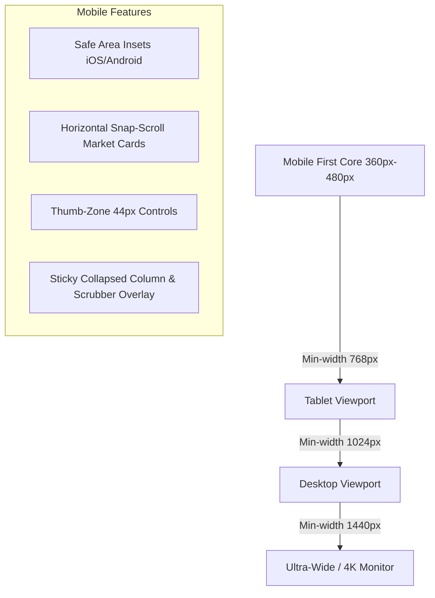
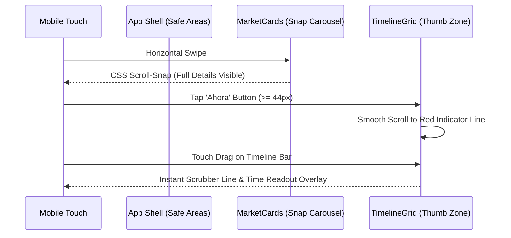

# Design: Mobile-First Refactor & UI Design Overhaul

## Architectural Context

The application currently features a dark financial dashboard theme with desktop-first CSS rules supplemented by max-width media query overrides. On mobile screens (<= 768px and <= 480px), `MarketCards` squishes into an ultra-condensed ticker row where country names, timezone labels, and market codes are hidden (`display: none;`), and the font sizes shrink below comfortable touch legibility.

This design transitions the styling philosophy to true **Mobile-First Progressive Enhancement**, treating 360px–480px mobile screens as the primary canvas and scaling upward fluidly.



## Architectural Decisions

### 1. CSS Architecture: Mobile-First with CSS Custom Properties & Clamps
- **Decision**: Base CSS rules target 360px+ screens without wrapping inside media queries. Media queries use `@media (min-width: 768px)` and `@media (min-width: 1024px)` to progressively expand cards and grids.
- **Rationale**: Ensures fast paint times on low-power mobile devices by avoiding cascading overrides and negations (`display: none`, then re-enabling).
- **Safe Area Insets**:
  ```css
  :root {
    --safe-top: env(safe-area-inset-top, 0px);
    --safe-bottom: env(safe-area-inset-bottom, 0px);
    --safe-left: env(safe-area-inset-left, 0px);
    --safe-right: env(safe-area-inset-right, 0px);
  }
  ```

### 2. MarketCards: Horizontal Scroll-Snap Carousel on Mobile
- **Decision**: On viewports < 768px, render `MarketCards` as a horizontal snap-scroll list (`scroll-snap-type: x mandatory`) with each card sized at `clamp(220px, 68vw, 280px)` and visible peek of next cards.
- **Rationale**: Restores 100% information richness on mobile screens: users see full country name, flag, market code, colored status badge, local time, and date. Swiping is native, fluid, and hardware accelerated. On desktop (>= 1024px), it expands into a 5-column grid.

### 3. Thumb-Zone Timeline Navigation Bar
- **Decision**: Redesign `.timeline-slider-bar` with an ergonomic height (>= 48px), thick touch slider track, enlarged thumb (24px x 24px), and a prominent "Centrar en Ahora" target button meeting the >= 44px WCAG / HIG touch target guidelines.
- **Rationale**: Eliminates precision friction on mobile screens when trying to navigate the 24h timeline with one hand.

### 4. Touch Scrubber Gesture Isolation
- **Decision**: Apply `touch-action: pan-y` on the scrollable wrapper and `touch-action: none` on the interactive scrubbing surface during active drags.
- **Rationale**: Prevents mobile browser gesture confusion (such as page pull-to-refresh or accidental vertical document bounces) while tracking horizontal scrubber movements.

## Component Data Flow



## Performance & Bundle Impact

- **Zero new external dependencies**: Implemented using pure CSS modern layout features (`scroll-snap-type`, `clamp()`, `env()`) and existing React 19 + Framer Motion components.
- **Render Isolation**: Existing `React.memo` and time offset calculation pipelines remain completely untouched and verified.

## Verification Strategy

1. **Automated Tests**:
   - Verify all unit tests (`src/core/render-optimization.test.ts`, `src/core/timezone.test.ts`) pass without regressions.
2. **Bundle Build**:
   - Ensure `npm run build` succeeds cleanly with valid PWA service worker and manifest generation.
3. **Viewport Matrix Testing**:
   - Mobile: 360x640 (entry mobile), 390x844 (iPhone 12/13/14), 412x915 (Pixel/Galaxy).
   - Tablet: 768x1024 (iPad).
   - Desktop: 1280x800 and 1920x1080.
