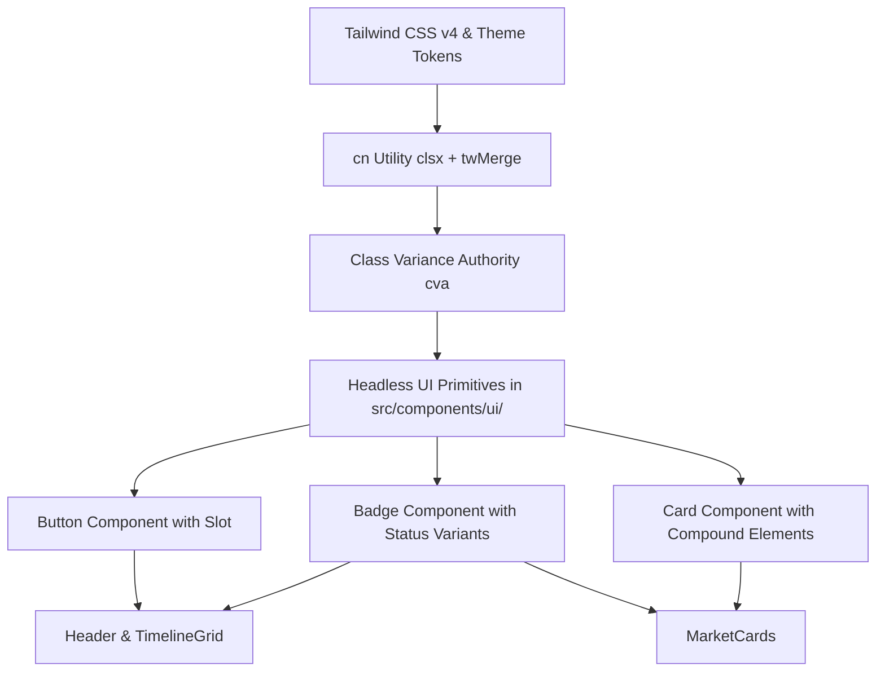
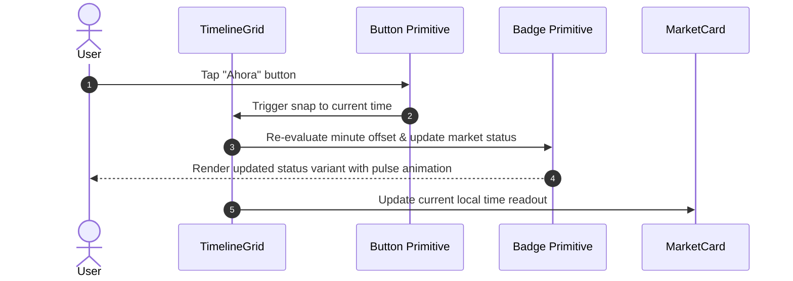

# Design: shadcn/ui Component Architecture & Design System

## Architectural Context

Following the successful migration to Tailwind CSS v4, we modernize the component architecture by introducing the industry-standard `shadcn/ui` composition pattern. This architecture decouples low-level DOM styling from business domain logic through reusable, headless, and accessible UI primitives.

## Component Interaction Flow

## Architectural Decisions

### 1. Composable Headless Primitives over Monolithic Component Libraries
- **Decision**: Adopt the shadcn/ui pattern (`src/components/ui/` owned directly in the codebase) utilizing `clsx`, `tailwind-merge`, and `class-variance-authority`, rather than installing an opaque npm component suite.
- **Rationale**: Full control over styling, zero runtime bundle bloat for unused components, easy adaptation to Tailwind v4, and effortless integration with existing Framer Motion animations.

### 2. Status Badge Variants via CVA
- **Decision**: Extend the base `badgeVariants` with financial market status variants: `open`, `lunch`, `pre`, and `closed`.
- **Rationale**: Centralizes financial status colors, borders, and glow effects in one declarative definition, removing ad-hoc utility repetition across `MarketCards.tsx` and `Header.tsx`.

### 3. Preserving Timeline 60 FPS Scrubber Isolation
- **Decision**: Keep the timeline table scroll and pointer-tracking scrubber inside its optimized DOM layout without wrapping high-frequency rendered tick marks in compound React components.
- **Rationale**: Prevents React reconciliation overhead during fast 60 FPS pointer scrub drag gestures.

### 4. Coexistence with Tailwind CSS v4 Theme
- **Decision**: Map shadcn CSS variables (`--card`, `--popover`, `--primary`, `--border`, etc.) directly into `src/index.css` alongside existing tokens.
- **Rationale**: Ensures full compatibility between legacy custom properties and modern shadcn design tokens without Preflight breakage.
